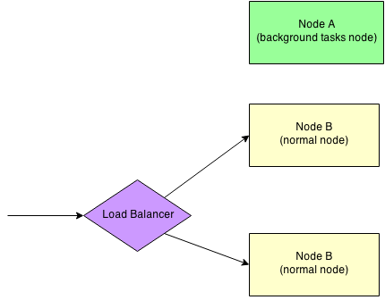

*참고:* 파일 검색 오피스 문서 미리보기를 가동하기 전, Seafile 클러스터의 다른 부분이 이미 동작중인지 확인하십시오. 예: 웹 브라우저의 파일 업로드/다운로드. memcached를 ["클러스터에서 구동하기"](./deploy_in_a_cluster.md)에서 설명한 대로 설정했는지 확인하십시오.

# 클러스터의 검색 기능 및 백그라운드 작업 활성화

**참고**: Seafile 서버 5.0.0부터 모든 설정 파일은 **conf** 폴더로 한 곳에 옮겨 모아둡니다. [더 읽어보십시오](../deploy/new_directory_layout_5_0_0.md).

Seafile 클러스터에서 다음을 수반하는 백그라운드 작업은 하나의 서버에서만 실행해야 합니다:

- 검색용 파일 색인 처리
- 전자메일 알림
- 오피스 문서 변환 서비스

클러스터의 노드가 A, B, C가 있다고 가정하겠습니다.

* 노드 A는 백그라운드 작업을 수행하는 백엔드 노드입니다.
* 노드 B 및 C는 클라이언트의 요청을 받는 프론트엔드 노드입니다.




## 노드 A (백엔드 노드) 설정

다음의 클러스터 설정 단계를 따른다면, 노드 B 및 C는 프론트엔드 노드로 이미 설정했습니다. 노드 A에 대한 노드 B의 설정을 기반 설정으로 복사할 수 있습니다. 그러면 다음 과정을 진행하십시오:

### 의존 요소 설치(자바, 리버오피스, poppler)

우분투/데비안:
```
sudo apt-get install openjdk-7-jre libreoffice poppler-utils python-uno # or python3-uno for ubuntu 14.04+
```

CentOS/레드햇:
```
sudo yum install java-1.7.0-openjdk
sudo yum install libreoffice libreoffice-headless libreoffice-pyuno
sudo yum install poppler-utils
```


**seafevents.conf**를 편집하여 다음 줄이 없는지 확인하십시오:

```
external_es_server = true
```

**seahub_settings.py**를 편집하여 다음 줄을 추가하십시오:

```
OFFICE_CONVERTOR_NODE = True
```

### 방화벽 규칙 편집

노드 A에 대한 방화벽 규칙에서 9500번 포트를 열어야 합니다(검색 요청용).

## 기타 노드 설정

노드 B 및 C에서, 다음 절차를 수행해야합니다:

* `seafevents.conf`를 편집하고 다음 줄을 추가하십시오:
```
[INDEX FILES]
external_es_server = true
es_host = <ip of node A>
es_port = 9500
```

**seahub_settings.py**를 편집하여 다음 줄을 추가하십시오:

```
OFFICE_CONVERTOR_ROOT = http://<ip of node A>
```

http://<노드 A의 IP> 요청을 Seahub에서도 처리하는지 확인하십시오. 이 설정을 백그라운드 노드의 Nginx 설정에 추가해야합니다:

```
server {
      listen 80;
      server_name <IP of node A>;
      location / {
          fastcgi_pass    127.0.0.1:8000;
          ...
  }
```

간단한 시험에서와 같이, 설정을 제대로 처리했는지 시험하려는 목적으로 이 명령을 사용할 수 있습니다.

```
curl -v http://<IP of node A>/office-convert/internal/status/
```

Nginx 설정을 업데이트하면 "400 Bad Request" 메시지가 뜹니다.


## 백그라운드 작업 시작

백그라운드 작업을 시작하기 전 Seafile 및 Seahub를 백엔드 노드에서 시작해야합니다.

```
./seafile.sh start
./seahub.sh start-fastcgi
```

노드 A(백그라운드 작업 노드)에서, 다음 명령으로 백그라운드 작업을 시작하거나 멈출 수 있습니다:

```
./seafile-background-tasks.sh { start | stop | restart }
```

