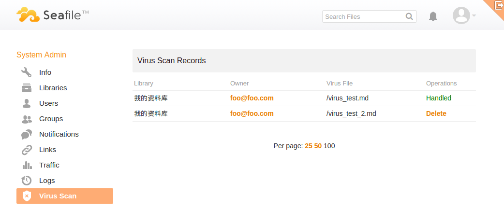

# 바이러스 검사

**참고**: Seafile 서버 5.0.0부터 모든 설정 파일은 **conf** 폴더로 한 곳에 옮겨 모아둡니다. [더 읽어보십시오](../deploy/new_directory_layout_5_0_0.md).

Seafile 전문가판 4.4.0(이상) 에서, 백그라운드 작업을 통해 업로드한 파일에 대한 바이러스를 검사할 수 있습니다. 주기적으로 실행하도록 설정했다면, 검사 과저은 서버의 모든 기존 라이브러리를 검사합니다. 각 검사 동작 수행시 최근 검사한 후 새로 업로드/업데이트 한 파일만 검사합니다. 각 파일에 대해, 프로세스는 파일이 바이러스인지 아닌지 확인하는 사용자 지정 바이러스 검사 명령을 실행합니다. 대부분의 바이러스 치료 프로그램은 리눅스용 명령행 유틸리티를 제공합니다.

이 기능을 활성화하려면 `seafile.conf`에 다음 설정 항목을 추가하십시오:

```
[virus_scan]
scan_command = (command for checking virus)
virus_code = (command exit codes when file is virus)
nonvirus_code = (command exit codes when file is not virus)
scan_interval = (scanning interval, in unit of minutes, default to 60 minutes)
```

설정 항목에 대한 좀 더 자세한 내용은 다음과 같습니다:

* 리눅스/유닉스에서 대부분의 바이러스 검사 명령에서는 바이러스가 있느냐 없느냐에 따라 지정 종료 코드를 반환합니다. 자세한 내용은 바이러스 검사 프로그램 설명서를 참고하십시오.

ClamAV (http://www.clamav.net/) 예제는 다음과 같습니다:

```
[virus_scan]
scan_command = clamscan
virus_code = 1
nonvirus_code = 0
```

설정한 대로 동작하는지 시험하려면 다음 검사 동작을 실행해보실 수 있습니다:

```
cd seafile-server-latest
./pro/pro.py virus_scan
```

바이러스를 발견하면, 검색 기록을 살펴보고 바이러스 검사 페이지에서 감혐 파일을 삭제할 수 있습니다.


